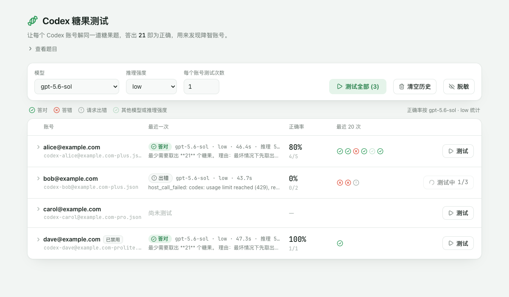

# Codex 糖果测试（CLIProxyAPI 插件）

在 [CLIProxyAPI](https://github.com/router-for-me/CLIProxyAPI)（CPA）的管理面板里，用一道糖果数学题测试你的 Codex 账号是否降智。题目来自 [codex-candy-eval](https://github.com/haowang02/codex-candy-eval)，正确答案是 **21**。



## 安装

在 CPA 根目录运行，插件会安装到当前目录的 `plugins/`。Docker 部署时，在挂载到容器 `/CLIProxyAPI/plugins` 的 `plugins` 目录的上一级目录运行。

macOS 和 Linux：

```sh
curl -fsSL https://raw.githubusercontent.com/haowang02/cpa-plugin-codex-candy-eval/main/install.sh | sh
```

Windows 请先停止 CPA，再在 PowerShell 中运行：

```powershell
irm https://raw.githubusercontent.com/haowang02/cpa-plugin-codex-candy-eval/main/install.ps1 | iex
```

也可以从 [Releases](https://github.com/haowang02/cpa-plugin-codex-candy-eval/releases/latest) 下载对应平台的压缩包，解压后将插件文件放入 `plugins/`。

## 配置

在 CPA 的 `config.yaml` 中启用插件，保存后 CPA 会自动加载：

```yaml
plugins:
  enabled: true
  dir: "plugins"
  configs:
    cpa-codex-candy-eval:
      enabled: true
```

插件没有其他配置项。升级插件后需要重启 CPA。

## 使用

选择模型、推理强度和测试次数，测试单个账号或全部已启用的账号。

- 回答中出现 21 即判为答对，正确率按当前所选的模型和推理强度统计。
- 每个账号保留最近 20 次测试记录。
- 点击「脱敏」可以模糊账号列，方便截图分享。
- 每次测试都会消耗被测账号的额度。

## 致谢

- [codex-candy-eval](https://github.com/haowang02/codex-candy-eval)
- [LINUX DO](https://linux.do/) - 新的理想型社区
