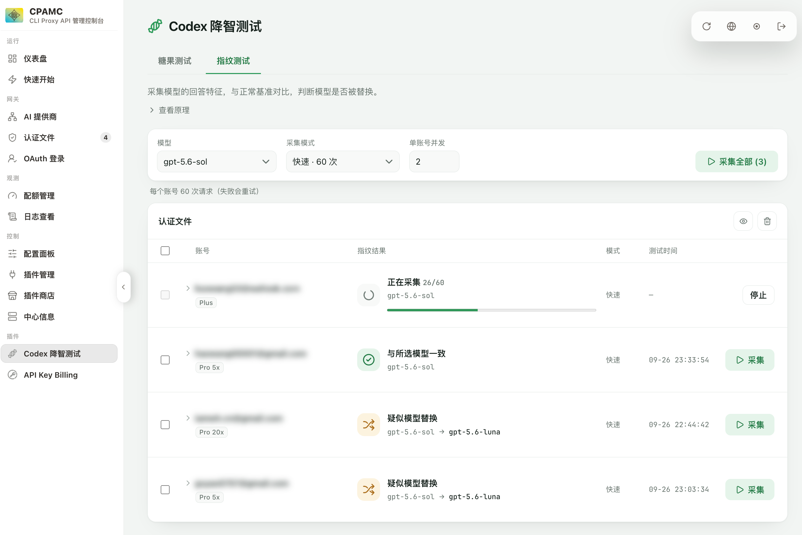

# Codex 降智测试（CLIProxyAPI 插件）

在 [CLIProxyAPI](https://github.com/router-for-me/CLIProxyAPI) 管理面板里，通过「糖果测试」和「指纹测试」测试 Codex 是否降智。



## 安装

### 插件商店

CPA 管理面板（CPAMC 或 CPAMP）插件商店搜索 `cpa-codex-candy-eval`。

### 人工安装

进入 CPA 工作目录，执行对应的安装命令。

macOS 和 Linux：

```sh
curl -fsSL https://raw.githubusercontent.com/haowang02/cpa-plugin-codex-candy-eval/main/install.sh | sh
```

Windows 请先停止 CPA，再在 PowerShell 中运行：

```powershell
irm https://raw.githubusercontent.com/haowang02/cpa-plugin-codex-candy-eval/main/install.ps1 | iex
```

也可以从 [Releases](https://github.com/haowang02/cpa-plugin-codex-candy-eval/releases/latest) 下载对应平台的压缩包，解压后将插件文件重命名为 `cpa-codex-candy-eval-v<版本号>.<扩展名>`，放入对应的 `plugins/<系统>/<架构>/` 目录。

在 CPA 的 `config.yaml` 中启用插件：

```yaml
plugins:
  enabled: true
  dir: "plugins"
  configs:
    cpa-codex-candy-eval:
      enabled: true
```

升级后重启 CPA，在管理面板左侧打开「Codex 降智测试」。

## 使用

### 糖果测试

选择模型、推理强度和次数，点击账号旁的「测试」，勾选账号后「测试所选」，或直接「测试全部」。正确答案为 **21**，页面会显示每次回答和正确率。

### 指纹测试

选择模型和模式，点击账号旁的「采集」。也可以勾选多个账号后「采集所选」，或直接「采集全部」。完成后会用图标和简短结论展示结果，疑似替换时会显示对应模型。

| 模式 | 每个账号的请求数 | 适用情况 |
| --- | ---: | --- |
| 快速 | **60 次** | 初步检查 |
| 标准 | **200 次** | 日常测试 |
| 严格 | **400 次** | 结果不明确时复测 |

默认使用快速模式，单账号并发为 **2**，可设为 1–6。推理强度固定为 `low`，无需设置。采集过程中可以点击「停止」，已发出的请求会执行完毕。失败请求会自动重试，实际请求数可能增加。

**如何看结果：**

- **与所选模型一致**：未发现与所选模型的正常指纹有明显差异。
- **疑似模型替换**：回答特征更符合其他模型，结果中会直接显示模型名称。
- **与所选模型有差异**：回答特征发生变化，暂时无法归因到某个模型。
- **暂无法判断 / 有效回答不足 / 结果不稳定**：当前结果不足以判断，建议使用严格模式复测。

点击账号可查看历史结果，点击「查看详情」可查看详细比对指标。指纹反映回答特征，不能单独证明模型身份或能力。

### 记录与额度

- 测试会消耗账号额度。
- 每个账号保留最近 20 次糖果测试和 5 组指纹测试，刷新或重启后仍可查看。
- 两类历史可分别清空。

## 致谢

- [codex-candy-eval](https://github.com/haowang02/codex-candy-eval)
- [LINUX DO](https://linux.do/) - 新的理想型社区
