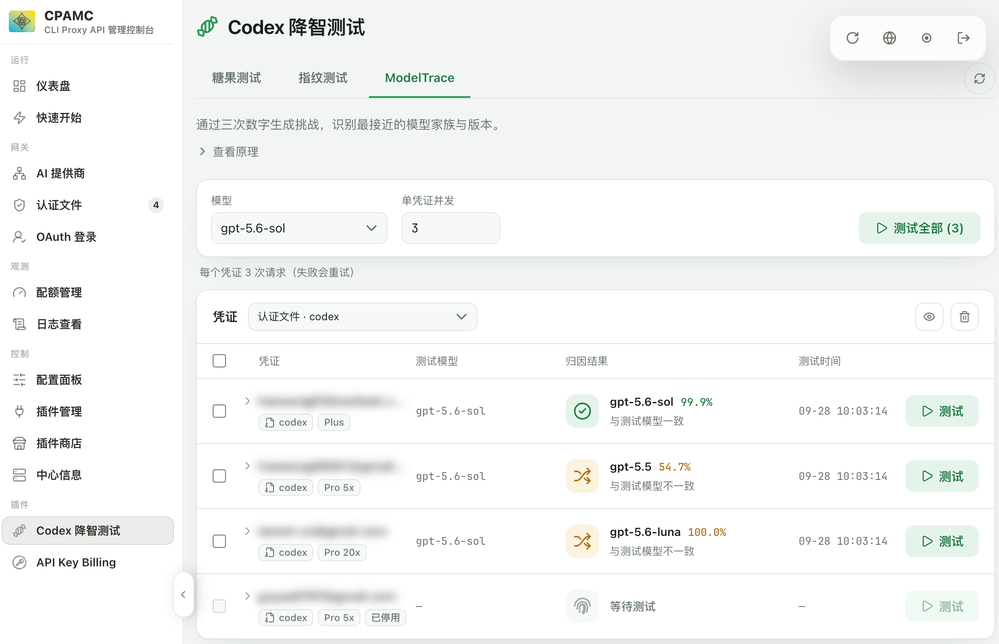

# Codex 降智测试（CLIProxyAPI 插件）

在 [CLIProxyAPI](https://github.com/router-for-me/CLIProxyAPI) 管理面板中进行**糖果测试**、**模型指纹测试**、**ModelTrace 模型归因**和**鹈鹕测试**。



## 安装

### CPA 版本要求

最低要求 CPA [v7.3.3](https://github.com/router-for-me/CLIProxyAPI/releases/tag/v7.3.3)。

### 插件商店

CPA 管理面板（CPAMC 或 CPAMP）插件商店搜索安装 `cpa-codex-candy-eval`，并在面板左侧打开「Codex 降智测试」。

### 人工安装

进入 CPA 工作目录，执行对应的安装命令。macOS 和 Linux：

```sh
curl -fsSL https://raw.githubusercontent.com/haowang02/cpa-plugin-codex-candy-eval/main/install.sh | sh
```

Windows 请先停止 CPA，再在 PowerShell 中运行：

```powershell
irm https://raw.githubusercontent.com/haowang02/cpa-plugin-codex-candy-eval/main/install.ps1 | iex
```

也可以从 [Releases](https://github.com/haowang02/cpa-plugin-codex-candy-eval/releases/latest) 下载对应平台的压缩包，解压后将插件文件重命名为 `cpa-codex-candy-eval-v<版本号>.<扩展名>`，放入对应的 `plugins/<系统>/<架构>/` 目录。

在 CPA 的 `config.yaml` 中启用插件：

```yaml
plugins:
  enabled: true
  dir: "plugins"
  configs:
    cpa-codex-candy-eval:
      enabled: true
```

## 使用

在「凭证」标题右侧选择类型，默认「认证文件 · codex」，也可选择「全部凭证」。点击凭证旁的按钮单独测试，或勾选多个凭证批量测试。未勾选时，批量操作针对当前类型下的全部可用凭证。

### 糖果测试

选择模型、推理强度和每凭证次数，点击「测试」。推理强度选择 `none` 时由 CPA 决定。

正确答案为 **21**。展开凭证可查看历次回答，正确率按当前选择的模型和推理强度统计。

### 指纹测试

选择模型和采集模式，点击「采集」。结果会提示与所选模型是否一致；疑似替换时会显示更接近的模型。展开凭证可查看历史记录和详情。

| 模式 | 每个凭证的请求数 | 适用情况 |
| --- | ---: | --- |
| 快速 | **60 次** | 初步检查 |
| 标准 | **200 次** | 日常测试 |
| 严格 | **400 次** | 结果不明确时复测 |

结果不明确或不稳定时，可使用严格模式复测。

### ModelTrace

选择模型，点击凭证旁的「测试」，或勾选凭证批量测试。插件自动生成三条数字挑战，与内置候选模型比对，显示最接近的模型、家族及归因概率。展开凭证可查看历史记录和详情。

### 鹈鹕测试

选择模型和推理强度，点击「测试」。模型会写出一个用 SVG 绘制鹈鹕骑自行车动画的 HTML 页面。列表和历史记录显示动画的缩略画面，点击即可放大播放。

### 记录与额度

- 测试会消耗凭证额度。糖果测试、ModelTrace 和鹈鹕测试的每次请求都以新会话的完整 Codex CLI 上下文发出，输入约 1.4 万 Token。
- 每个凭证的每种测试都保留最近 20 次记录，刷新或重启后仍可查看。
- 点击标签栏右侧的垃圾桶可清空全部测试记录；凭证列表右上角的垃圾桶只清空当前测试的记录。
- 单次请求有时间限制：ModelTrace 和指纹测试 3 分钟，糖果测试和鹈鹕测试 10 分钟。超时的请求会被中断。

## 致谢

- [codex-candy-eval](https://github.com/haowang02/codex-candy-eval)
- [ModelTrace](https://github.com/xqy2006/ModelTrace) — 数字指纹归因方法与候选库（MIT）
- [LINUX DO](https://linux.do/) - 新的理想型社区
